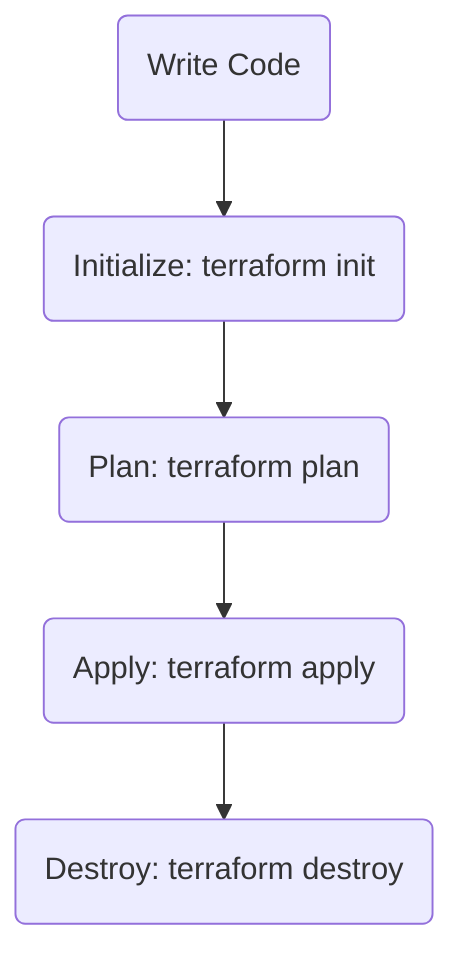

# Understanding How Terraform Works

Now that you have a basic understanding of what Terraform is, let's dive deeper into how Terraform works, focusing on resource blocks, providers, and authentication etc

---

## 1. How Terraform Works

Terraform is an Infrastructure as Code (IaC) tool that allows you to define, provision, and manage infrastructure using configuration files. You write your infrastructure requirements in simple, human-readable configuration files, and Terraform takes care of creating and managing those resources for you.

---

## 2. Installing Terraform

### On Linux

```sh
# Download the latest Terraform package
wget https://releases.hashicorp.com/terraform/1.8.5/terraform_1.8.5_linux_amd64.zip
# Unzip the package
unzip terraform_1.8.5_linux_amd64.zip
# Move the binary to a directory included in your PATH
sudo mv terraform /usr/local/bin/
# Verify installation
terraform -v
```

### On Windows

1. Download the Terraform zip file from [Terraform Downloads](https://www.terraform.io/downloads.html).
2. Unzip the file and move `terraform.exe` to a folder included in your system's PATH.
3. Open Command Prompt and run:
    ```sh
    terraform -v
    ```

---

## 3. Providers in Terraform

Terraform is unique because it supports a wide range of **providers**—these are plugins that allow Terraform to interact with different cloud platforms and services (like AWS, Azure, Google Cloud, etc.).

- **Why so many providers?**  
  Providers allow Terraform to manage resources across multiple platforms using the same workflow and language.

- **Provider Versions:**  
  You can specify which version of a provider you want to use in your configuration. For example, to use AWS provider version 5.x, you can write:

  Each major version or minor version may introduce breaking changes. For example, AWS provider version 4 introduced changes to default tags and resource arguments, while version 5 removed deprecated arguments and improved resource management. Always review the [provider's changelog](https://github.com/hashicorp/terraform-provider-aws/blob/main/CHANGELOG.md) before upgrading to understand what has changed and why updates may be required.

  
## 3.1. How to Call a Provider in Terraform

To use a provider (for example, AWS), you need to declare it in your configuration. You can also specify which version of the provider you want to use. Here’s how you can call the AWS provider and specify its version:

> **Note:**  
> The following provider block should be placed in a file named `terraform.tf` (or any `.tf` file) in your Terraform project directory.

```hcl
terraform {
  required_providers {
    aws = {
      source  = "hashicorp/aws"
      version = "~> 5.0"
    }
  }
}
```

# 3.2. Initializing and Downloading the Provider

Once you have written your provider block in `terraform.tf`, you need to download the provider plugin. This is done using the `terraform init` command.

```sh
terraform init
```

When you run this command in your project directory, Terraform will:

- Download the required provider plugins (like AWS) specified in your configuration.
- Create a `.terraform` folder in your directory.  
- Inside this folder, you will find subfolders and files related to the provider plugins. These are the actual binaries that Terraform uses to communicate with the cloud provider (e.g., AWS) when you run other Terraform commands.

This step ensures that your Terraform project is ready to interact with the specified provider.

---


## 4. Writing Your First Resource Block

Suppose you want to create an AWS EC2 instance. In Terraform, you define this using a **resource block**.

```hcl
provider "aws" {
  region = "us-east-1"
}

resource "aws_instance" "example" {
  ami           = "ami-xxxxxxxxxxxxx"
  instance_type = "t2.micro"
}
```

- The `provider` block tells Terraform which cloud provider to use.
- The `resource` block defines the resource you want to create (in this case, an EC2 instance).

### What is a Resource Block?

A **resource block** in Terraform is the fundamental building block for defining infrastructure. It tells Terraform what kind of resource you want to create, which provider to use, and the configuration details for that resource.

- The `provider` block specifies which cloud provider (in this case, AWS) Terraform should use and any required settings, such as the region.
- The `resource` block defines the actual infrastructure component you want to manage. Here, `aws_instance` tells Terraform you want to create an EC2 instance, and `"example"` is a local name you give to this resource.
- Inside the resource block, you specify arguments like `ami` (the Amazon Machine Image ID) and `instance_type` (the size/type of the EC2 instance).

**Why is this important?**  
Every piece of infrastructure you want Terraform to manage—whether it's a server, database, network, or something else—will be described using a resource block. This is how you declare your desired state.

**What happens next?**  
If you try to run `terraform plan` or `terraform apply` at this stage, Terraform will attempt to connect to AWS to create the EC2 instance. If you haven't provided valid AWS credentials, you will get an error about being unauthorized or missing credentials.

This is why understanding authentication is the next critical step.

---

## 5. How Terraform Authenticates with AWS

When using Terraform to create resources in AWS, authentication and authorization are crucial. AWS supports multiple ways to provide credentials:

- **Environment Variables:**  
    ```sh
    export AWS_ACCESS_KEY_ID="your-access-key-id"
    export AWS_SECRET_ACCESS_KEY="your-secret-access-key"
    ```

- **AWS CLI Configuration:**  
  If you have configured the AWS CLI (`aws configure`), Terraform will use those credentials by default.

- **Shared Credentials File:**  
  Located at `~/.aws/credentials` on Linux/Mac or `%USERPROFILE%\.aws\credentials` on Windows.

- **Directly in the Provider Block (not recommended for production):**  
  You can also specify your access key and secret key directly in the provider block for testing purposes:

    ```hcl
    provider "aws" {
      region     = "us-west-1"
      access_key = "your-access-key-id"
      secret_key = "your-secret-access-key"
    }
    ```

> **Note:**  
> Storing credentials directly in code is not recommended for production environments. Prefer environment variables or AWS CLI profiles for better security.

---

## 6. How Terraform is Authorized

- **IAM Permissions:**  
  The AWS user or role whose credentials you provide must have the necessary IAM permissions to create, modify, or delete the resources you define in your Terraform configuration.

---

## Terraform Lifecycle Flow Chart


