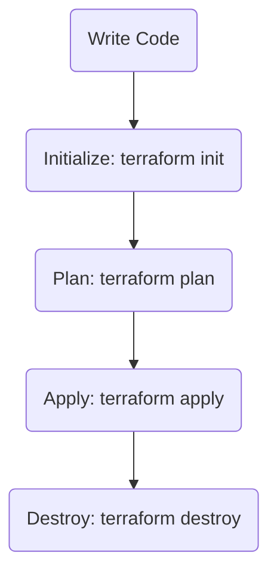

## Terraform Lifecycle Flow Chart

```mermaid
flowchart TD
    A(Write Code) --> B(Initialize: terraform init)
    B --> C(Plan: terraform plan)
    C --> D(Apply: terraform apply)
    D --> E(Destroy: terraform destroy)
```
